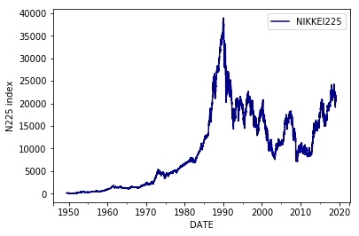
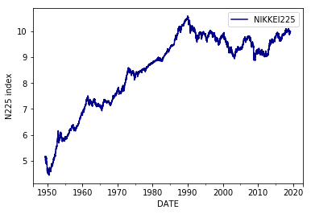
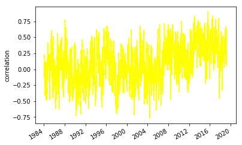
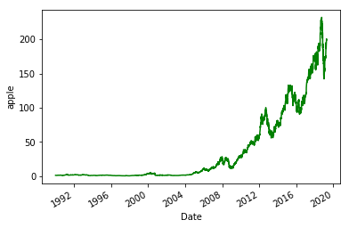
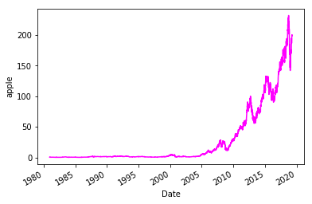
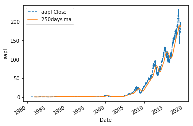
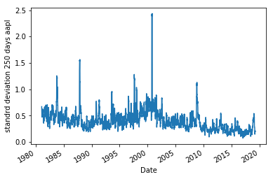

# 第4章 PandasとMatplotlibを使ってみよう
## 4.1 データのダウンロード


```python
import pandas_datareader.data as web
start="1949/5/16"
end="2019/3/30"#適当に入れ替えてください。
N225 = web.DataReader("NIKKEI225", 'fred',start,end)
N225.head(1)
```


<div>
<style scoped>
    .dataframe tbody tr th:only-of-type {
        vertical-align: middle;
    }

    .dataframe tbody tr th {
        vertical-align: top;
    }

    .dataframe thead th {
        text-align: right;
    }
</style>
<table border="1" class="dataframe">
  <thead>
    <tr style="text-align: right;">
      <th></th>
      <th>NIKKEI225</th>
    </tr>
    <tr>
      <th>DATE</th>
      <th></th>
    </tr>
  </thead>
  <tbody>
    <tr>
      <th>1949-05-16</th>
      <td>176.21</td>
    </tr>
  </tbody>
</table>
</div>


```python
N225.tail(1)
```


<div>
<style scoped>
    .dataframe tbody tr th:only-of-type {
        vertical-align: middle;
    }

    .dataframe tbody tr th {
        vertical-align: top;
    }

    .dataframe thead th {
        text-align: right;
    }
</style>
<table border="1" class="dataframe">
  <thead>
    <tr style="text-align: right;">
      <th></th>
      <th>NIKKEI225</th>
    </tr>
    <tr>
      <th>DATE</th>
      <th></th>
    </tr>
  </thead>
  <tbody>
    <tr>
      <th>2019-03-29</th>
      <td>21205.81</td>
    </tr>
  </tbody>
</table>
</div>


```python
%matplotlib inline
import matplotlib.pyplot as plt
N225.plot(color='darkblue')
plt.ylabel('N225 index')
```


    Text(0, 0.5, 'N225 index')





```python
N225.to_csv("NIKKEI225.csv")
```


```python
%matplotlib inline
import numpy as np
np.log(N225).plot(color='darkblue')
plt.ylabel('N225 index')
```


    Text(0, 0.5, 'N225 index')





plt.show()を追加することにより出力の仕方が変わりました。

## 4.2 データベースの加工


```python
price = web.DataReader("^N225",'yahoo',"1984/1/4",end)
price.head(1)
price.tail(1)
```


<div>
<style scoped>
    .dataframe tbody tr th:only-of-type {
        vertical-align: middle;
    }

    .dataframe tbody tr th {
        vertical-align: top;
    }

    .dataframe thead th {
        text-align: right;
    }
</style>
<table border="1" class="dataframe">
  <thead>
    <tr style="text-align: right;">
      <th></th>
      <th>High</th>
      <th>Low</th>
      <th>Open</th>
      <th>Close</th>
      <th>Volume</th>
      <th>Adj Close</th>
    </tr>
    <tr>
      <th>Date</th>
      <th></th>
      <th></th>
      <th></th>
      <th></th>
      <th></th>
      <th></th>
    </tr>
  </thead>
  <tbody>
    <tr>
      <th>2019-03-29</th>
      <td>21267.25</td>
      <td>21149.419922</td>
      <td>21228.509766</td>
      <td>21205.810547</td>
      <td>61600.0</td>
      <td>21205.810547</td>
    </tr>
  </tbody>
</table>
</div>


```python
import pandas as pd
fx = web.DataReader('DEXJPUS',"fred",start,end)
port=pd.concat([price.Close,fx],axis=1).dropna()
```


```python
n=port.Close.pct_change().dropna()
f=port.DEXJPUS.pct_change().dropna()
f.rolling(window=20).corr(n).plot(color="yellow")
plt.ylabel('correlation')
```


    Text(0, 0.5, 'correlation')





```python
import datetime
end=datetime.datetime.now()
start="1980/1/1"
price = web.DataReader("AAPL", 'yahoo',start,end)
```


```python
price1=price.loc["1990/1/1":]#ixの停止によりlocに変更
price1.Close.plot(color='green')
price2=price["2015"].iloc[0:2]#ixの停止によりilocに変更
print(price2)
plt.ylabel('apple')
```

                      High         Low        Open       Close      Volume  \
    Date                                                                     
    2015-01-02  111.440002  107.349998  111.389999  109.330002  53204600.0   
    2015-01-05  108.650002  105.410004  108.290001  106.250000  64285500.0   
    
                 Adj Close  
    Date                    
    2015-01-02  101.528191  
    2015-01-05   98.667984  
    


    Text(0, 0.5, 'apple')





```python
print(price.resample('M').first().tail())
```

                      High         Low        Open       Close      Volume  \
    Date                                                                     
    2018-12-31  184.940002  181.210007  184.460007  184.820007  40802500.0   
    2019-01-31  158.850006  154.229996  154.889999  157.919998  37039700.0   
    2019-02-28  168.979996  165.929993  166.960007  166.520004  32668100.0   
    2019-03-31  175.149994  172.889999  174.279999  174.970001  25886200.0   
    2019-04-30  191.679993  188.380005  191.639999  191.240005  27862000.0   
    
                 Adj Close  
    Date                    
    2018-12-31  184.030731  
    2019-01-31  157.245605  
    2019-02-28  165.808884  
    2019-03-31  174.970001  
    2019-04-30  191.240005  
    


```python
print(price.resample('M').last().tail())
```

                      High         Low        Open       Close      Volume  \
    Date                                                                     
    2018-12-31  159.360001  156.479996  158.529999  157.740005  35003500.0   
    2019-01-31  169.000000  164.559998  166.110001  166.440002  40739600.0   
    2019-02-28  174.910004  172.919998  174.320007  173.149994  28215400.0   
    2019-03-31  190.080002  188.539993  189.830002  189.949997  23564000.0   
    2019-04-30  200.139999  196.210007  199.199997  198.869995  27744300.0   
    
                 Adj Close  
    Date                    
    2018-12-31  157.066376  
    2019-01-31  165.729218  
    2019-02-28  173.149994  
    2019-03-31  189.949997  
    2019-04-30  198.869995  
    


```python
print(price.resample('M',loffset='1d').last().tail())
```

                      High         Low        Open       Close      Volume  \
    Date                                                                     
    2019-01-01  159.360001  156.479996  158.529999  157.740005  35003500.0   
    2019-02-01  169.000000  164.559998  166.110001  166.440002  40739600.0   
    2019-03-01  174.910004  172.919998  174.320007  173.149994  28215400.0   
    2019-04-01  190.080002  188.539993  189.830002  189.949997  23564000.0   
    2019-05-01  200.139999  196.210007  199.199997  198.869995  27744300.0   
    
                 Adj Close  
    Date                    
    2019-01-01  157.066376  
    2019-02-01  165.729218  
    2019-03-01  173.149994  
    2019-04-01  189.949997  
    2019-05-01  198.869995  
    


```python
price.resample('A').Close.plot(color='magenta')
plt.ylabel('apple')
```


    Text(0, 0.5, 'apple')





## 4.3 データの加工、分析


```python
import numpy as np
dp=np.log(price.Close).diff()
vol=dp.std()*np.sqrt(250)
print(vol,len(price))
```

    0.4630790529648526 9665
    


```python
import pandas as pd
ma=pd.Series.rolling(price.Close,window=250).mean()
price.Close.plot(label='aapl Close',style='--')
ma.plot(label='250days ma')
plt.ylabel('aapl')
plt.legend()
```


    <matplotlib.legend.Legend at 0x2d8485bdd30>





```python
(pd.Series.rolling(np.log(price.Close).diff().dropna(),window=25).std()*np.sqrt(250)).plot()
plt.ylabel('standrd deviation 250 days aapl')
```


    Text(0, 0.5, 'standrd deviation 250 days aapl')





```python

```


```python

```
