# 第6章　トレンドをモデル化しよう
## 6.4 日経平均株価の確定的トレンド


```python
import pandas_datareader.data as web
import statsmodels.api as sm
import numpy as np
end='2019/12/30'
n225 = web.DataReader("NIKKEI225", 'fred',"1949/5/16",end).dropna()
lnn225=np.log(n225.dropna())
lnn225.columns=['Close']
y=lnn225
x=range(len(lnn225))
x=sm.add_constant(x)
model=sm.OLS(y,x)
results=model.fit()
```


```python
print(results.summary())
```

                                OLS Regression Results                            
    ==============================================================================
    Dep. Variable:                  Close   R-squared:                       0.756
    Model:                            OLS   Adj. R-squared:                  0.756
    Method:                 Least Squares   F-statistic:                 5.374e+04
    Date:                Mon, 15 Apr 2019   Prob (F-statistic):               0.00
    Time:                        11:32:35   Log-Likelihood:                -19307.
    No. Observations:               17390   AIC:                         3.862e+04
    Df Residuals:                   17388   BIC:                         3.863e+04
    Df Model:                           1                                         
    Covariance Type:            nonrobust                                         
    ==============================================================================
                     coef    std err          t      P>|t|      [0.025      0.975]
    ------------------------------------------------------------------------------
    const          6.2513      0.011    561.236      0.000       6.229       6.273
    x1             0.0003   1.11e-06    231.825      0.000       0.000       0.000
    ==============================================================================
    Omnibus:                      460.628   Durbin-Watson:                   0.000
    Prob(Omnibus):                  0.000   Jarque-Bera (JB):              229.739
    Skew:                          -0.030   Prob(JB):                     1.30e-50
    Kurtosis:                       2.440   Cond. No.                     2.01e+04
    ==============================================================================
    
    Warnings:
    [1] Standard Errors assume that the covariance matrix of the errors is correctly specified.
    [2] The condition number is large, 2.01e+04. This might indicate that there are
    strong multicollinearity or other numerical problems.
    


```python
%matplotlib inline
import matplotlib.pyplot as plt
plt.plot(y,label='Close',color="darkgray")
results.fittedvalues.plot(label='prediction',style='--')
plt.ylabel('log(n225 index)')
plt.legend(loc='upper left')
```


    <matplotlib.legend.Legend at 0x26c1ab5f390>


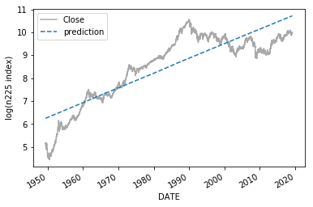


```python
results.resid.plot(color="seagreen")
plt.ylabel('residual')
```


    Text(0, 0.5, 'residual')


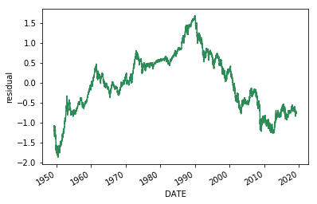


```python
results.resid.hist(bins=100,color="lightgray")
plt.xlabel('residual')
plt.ylabel('frequency')
```


    Text(0, 0.5, 'frequency')


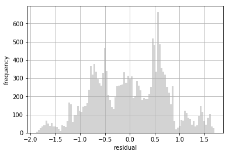


```python
y=lnn225.loc[:'1954/11/30'].dropna()
x=range(len(y))
x=sm.add_constant(x)
model=sm.OLS(y,x)
results=model.fit()
print(results.summary())
```

                                OLS Regression Results                            
    ==============================================================================
    Dep. Variable:                  Close   R-squared:                       0.762
    Model:                            OLS   Adj. R-squared:                  0.761
    Method:                 Least Squares   F-statistic:                     4438.
    Date:                Mon, 15 Apr 2019   Prob (F-statistic):               0.00
    Time:                        11:32:37   Log-Likelihood:                -65.389
    No. Observations:                1391   AIC:                             134.8
    Df Residuals:                    1389   BIC:                             145.3
    Df Model:                           1                                         
    Covariance Type:            nonrobust                                         
    ==============================================================================
                     coef    std err          t      P>|t|      [0.025      0.975]
    ------------------------------------------------------------------------------
    const          4.5236      0.014    332.550      0.000       4.497       4.550
    x1             0.0011   1.69e-05     66.618      0.000       0.001       0.001
    ==============================================================================
    Omnibus:                      160.558   Durbin-Watson:                   0.003
    Prob(Omnibus):                  0.000   Jarque-Bera (JB):              121.287
    Skew:                           0.624   Prob(JB):                     4.60e-27
    Kurtosis:                       2.268   Cond. No.                     1.60e+03
    ==============================================================================
    
    Warnings:
    [1] Standard Errors assume that the covariance matrix of the errors is correctly specified.
    [2] The condition number is large, 1.6e+03. This might indicate that there are
    strong multicollinearity or other numerical problems.
    


```python
results.resid.std()
```


    0.2537083247963736


```python
plt.plot(y,label='Close',color='darkgray')
results.fittedvalues.plot(label='prediction',style='--')
plt.legend(loc='upper left')
plt.ylabel('log(n225 index)')
```


    Text(0, 0.5, 'log(n225 index)')


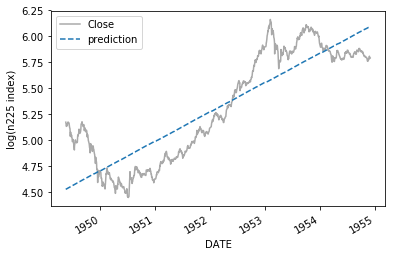


```python
y=lnn225.loc['1954/12/1':'1971/12/31'].dropna()
x=range(len(y))
x=sm.add_constant(x)
model=sm.OLS(y,x)
results=model.fit()
print(results.summary())
```

                                OLS Regression Results                            
    ==============================================================================
    Dep. Variable:                  Close   R-squared:                       0.824
    Model:                            OLS   Adj. R-squared:                  0.824
    Method:                 Least Squares   F-statistic:                 1.995e+04
    Date:                Mon, 15 Apr 2019   Prob (F-statistic):               0.00
    Time:                        11:32:38   Log-Likelihood:                 257.20
    No. Observations:                4272   AIC:                            -510.4
    Df Residuals:                    4270   BIC:                            -497.7
    Df Model:                           1                                         
    Covariance Type:            nonrobust                                         
    ==============================================================================
                     coef    std err          t      P>|t|      [0.025      0.975]
    ------------------------------------------------------------------------------
    const          6.1675      0.007    884.618      0.000       6.154       6.181
    x1             0.0004   2.83e-06    141.244      0.000       0.000       0.000
    ==============================================================================
    Omnibus:                      396.700   Durbin-Watson:                   0.002
    Prob(Omnibus):                  0.000   Jarque-Bera (JB):              516.452
    Skew:                           0.851   Prob(JB):                    7.14e-113
    Kurtosis:                       3.082   Cond. No.                     4.93e+03
    ==============================================================================
    
    Warnings:
    [1] Standard Errors assume that the covariance matrix of the errors is correctly specified.
    [2] The condition number is large, 4.93e+03. This might indicate that there are
    strong multicollinearity or other numerical problems.
    


```python
plt.plot(y,label='Close',color='seagreen')
results.fittedvalues.plot(label='prediction',style='--')
plt.legend(loc='upper left')
plt.ylabel('log(n225 index)')
```


    Text(0, 0.5, 'log(n225 index)')


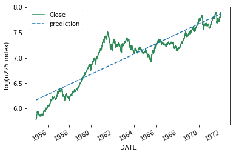


```python
y=lnn225.loc['1972/1/1':'1986/11/30'].dropna()
x=range(len(y))
x=sm.add_constant(x)
model=sm.OLS(y,x)
results=model.fit()
print(results.summary())
```

                                OLS Regression Results                            
    ==============================================================================
    Dep. Variable:                  Close   R-squared:                       0.910
    Model:                            OLS   Adj. R-squared:                  0.910
    Method:                 Least Squares   F-statistic:                 3.791e+04
    Date:                Mon, 15 Apr 2019   Prob (F-statistic):               0.00
    Time:                        11:32:38   Log-Likelihood:                 2451.9
    No. Observations:                3768   AIC:                            -4900.
    Df Residuals:                    3766   BIC:                            -4887.
    Df Model:                           1                                         
    Covariance Type:            nonrobust                                         
    ==============================================================================
                     coef    std err          t      P>|t|      [0.025      0.975]
    ------------------------------------------------------------------------------
    const          8.1001      0.004   1969.386      0.000       8.092       8.108
    x1             0.0004   1.89e-06    194.702      0.000       0.000       0.000
    ==============================================================================
    Omnibus:                      548.042   Durbin-Watson:                   0.004
    Prob(Omnibus):                  0.000   Jarque-Bera (JB):              813.397
    Skew:                           1.077   Prob(JB):                    2.36e-177
    Kurtosis:                       3.736   Cond. No.                     4.35e+03
    ==============================================================================
    
    Warnings:
    [1] Standard Errors assume that the covariance matrix of the errors is correctly specified.
    [2] The condition number is large, 4.35e+03. This might indicate that there are
    strong multicollinearity or other numerical problems.
    


```python
plt.plot(y,label='Close',color='hotpink')
results.fittedvalues.plot(label='prediction',style='--')
plt.legend(loc='upper left')
plt.ylabel('log(n225 index)')
```


    Text(0, 0.5, 'log(n225 index)')


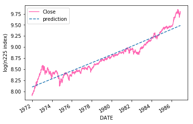


```python
y=lnn225.loc['1986/12/1':'1993/10/31'].dropna()
x=range(len(y))
x=sm.add_constant(x)
model=sm.OLS(y,x)
results=model.fit()
print(results.summary())
```

                                OLS Regression Results                            
    ==============================================================================
    Dep. Variable:                  Close   R-squared:                       0.215
    Model:                            OLS   Adj. R-squared:                  0.215
    Method:                 Least Squares   F-statistic:                     467.5
    Date:                Mon, 15 Apr 2019   Prob (F-statistic):           7.99e-92
    Time:                        11:32:39   Log-Likelihood:                 305.16
    No. Observations:                1707   AIC:                            -606.3
    Df Residuals:                    1705   BIC:                            -595.4
    Df Model:                           1                                         
    Covariance Type:            nonrobust                                         
    ==============================================================================
                     coef    std err          t      P>|t|      [0.025      0.975]
    ------------------------------------------------------------------------------
    const         10.2897      0.010   1050.279      0.000      10.271      10.309
    x1            -0.0002   9.95e-06    -21.622      0.000      -0.000      -0.000
    ==============================================================================
    Omnibus:                       40.208   Durbin-Watson:                   0.005
    Prob(Omnibus):                  0.000   Jarque-Bera (JB):               22.069
    Skew:                           0.077   Prob(JB):                     1.61e-05
    Kurtosis:                       2.465   Cond. No.                     1.97e+03
    ==============================================================================
    
    Warnings:
    [1] Standard Errors assume that the covariance matrix of the errors is correctly specified.
    [2] The condition number is large, 1.97e+03. This might indicate that there are
    strong multicollinearity or other numerical problems.
    


```python
plt.plot(y,label='Close',color='seagreen')
results.fittedvalues.plot(label='prediction',style='--')
plt.legend()
plt.ylabel('log(n225 index)')
```


    Text(0, 0.5, 'log(n225 index)')


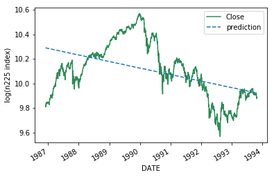


```python
y=lnn225.loc['1986/12/1':'1989/12/31'].dropna()
x=range(len(y))
x=sm.add_constant(x)
model=sm.OLS(y,x)
results=model.fit()
print(results.summary())
```

                                OLS Regression Results                            
    ==============================================================================
    Dep. Variable:                  Close   R-squared:                       0.913
    Model:                            OLS   Adj. R-squared:                  0.913
    Method:                 Least Squares   F-statistic:                     8011.
    Date:                Mon, 15 Apr 2019   Prob (F-statistic):               0.00
    Time:                        11:32:39   Log-Likelihood:                 1142.0
    No. Observations:                 765   AIC:                            -2280.
    Df Residuals:                     763   BIC:                            -2271.
    Df Model:                           1                                         
    Covariance Type:            nonrobust                                         
    ==============================================================================
                     coef    std err          t      P>|t|      [0.025      0.975]
    ------------------------------------------------------------------------------
    const          9.9122      0.004   2520.009      0.000       9.904       9.920
    x1             0.0008   8.91e-06     89.506      0.000       0.001       0.001
    ==============================================================================
    Omnibus:                        1.148   Durbin-Watson:                   0.043
    Prob(Omnibus):                  0.563   Jarque-Bera (JB):                1.193
    Skew:                           0.092   Prob(JB):                        0.551
    Kurtosis:                       2.943   Cond. No.                         882.
    ==============================================================================
    
    Warnings:
    [1] Standard Errors assume that the covariance matrix of the errors is correctly specified.
    


```python
print("return ",np.exp(y.Close).pct_change().mean()*250)
print("volatility ",y.Close.diff().std()*np.sqrt(250))
print("std of residual",results.resid.std())
plt.plot(y,label='Close',color='darkgray')
results.fittedvalues.plot(label='prediction',style='--')
plt.legend(loc='upper left')
plt.ylabel('log(n225 index)')
```

    return  0.2624257002375478
    volatility  0.17750214293324648
    std of residual 0.054413688241352696
    


    Text(0, 0.5, 'log(n225 index)')


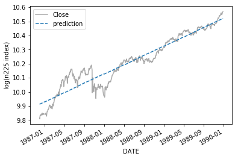


```python
results.resid.hist(bins=10,color="yellow")
plt.xlabel('residual')
plt.ylabel('frequency')
```


    Text(0, 0.5, 'frequency')


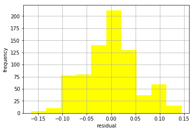


```python
y=lnn225.loc['1990/1/1':'1992/8/31'].dropna()
x=range(len(y))
x=sm.add_constant(x)
model=sm.OLS(y,x)
results=model.fit()
print(results.summary())
```

                                OLS Regression Results                            
    ==============================================================================
    Dep. Variable:                  Close   R-squared:                       0.816
    Model:                            OLS   Adj. R-squared:                  0.815
    Method:                 Least Squares   F-statistic:                     2891.
    Date:                Mon, 15 Apr 2019   Prob (F-statistic):          3.24e-242
    Time:                        11:32:41   Log-Likelihood:                 622.33
    No. Observations:                 656   AIC:                            -1241.
    Df Residuals:                     654   BIC:                            -1232.
    Df Model:                           1                                         
    Covariance Type:            nonrobust                                         
    ==============================================================================
                     coef    std err          t      P>|t|      [0.025      0.975]
    ------------------------------------------------------------------------------
    const         10.4342      0.007   1425.476      0.000      10.420      10.449
    x1            -0.0010   1.93e-05    -53.767      0.000      -0.001      -0.001
    ==============================================================================
    Omnibus:                       49.072   Durbin-Watson:                   0.038
    Prob(Omnibus):                  0.000   Jarque-Bera (JB):               39.778
    Skew:                          -0.516   Prob(JB):                     2.30e-09
    Kurtosis:                       2.375   Cond. No.                         756.
    ==============================================================================
    
    Warnings:
    [1] Standard Errors assume that the covariance matrix of the errors is correctly specified.
    


```python
print("return ",np.exp(y.Close).pct_change().mean()*250)
print("volatility ",y.Close.diff().std()*np.sqrt(250))
print("std of residual",results.resid.std())
plt.plot(y,label='Close',color='seagreen')
results.fittedvalues.plot(label='prediction',style='--')
plt.legend()
plt.ylabel('log(n225 index)')
```

    return  -0.2494591088293264
    volatility  0.2875148439731868
    std of residual 0.09377499471074396
    


    Text(0, 0.5, 'log(n225 index)')


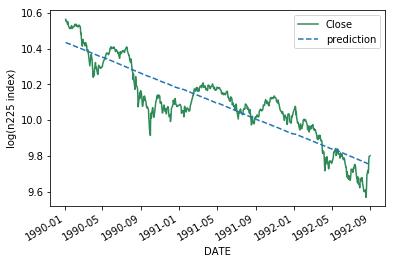


```python
results.resid.hist(bins=10,color="mistyrose")
plt.xlabel('residual')
plt.ylabel('frequency')
```


    Text(0, 0.5, 'frequency')


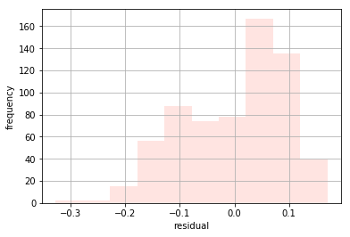


```python
y=lnn225.loc['1993/11/1':].dropna()
x=range(len(y))
x=sm.add_constant(x)
model=sm.OLS(y,x)
results=model.fit()
print(results.summary())
```

                                OLS Regression Results                            
    ==============================================================================
    Dep. Variable:                  Close   R-squared:                       0.005
    Model:                            OLS   Adj. R-squared:                  0.005
    Method:                 Least Squares   F-statistic:                     31.99
    Date:                Mon, 15 Apr 2019   Prob (F-statistic):           1.62e-08
    Time:                        11:32:42   Log-Likelihood:                -1325.9
    No. Observations:                6252   AIC:                             2656.
    Df Residuals:                    6250   BIC:                             2669.
    Df Model:                           1                                         
    Covariance Type:            nonrobust                                         
    ==============================================================================
                     coef    std err          t      P>|t|      [0.025      0.975]
    ------------------------------------------------------------------------------
    const          9.6079      0.008   1269.765      0.000       9.593       9.623
    x1         -1.186e-05    2.1e-06     -5.656      0.000    -1.6e-05   -7.75e-06
    ==============================================================================
    Omnibus:                     2655.592   Durbin-Watson:                   0.002
    Prob(Omnibus):                  0.000   Jarque-Bera (JB):              400.453
    Skew:                          -0.284   Prob(JB):                     1.10e-87
    Kurtosis:                       1.898   Cond. No.                     7.22e+03
    ==============================================================================
    
    Warnings:
    [1] Standard Errors assume that the covariance matrix of the errors is correctly specified.
    [2] The condition number is large, 7.22e+03. This might indicate that there are
    strong multicollinearity or other numerical problems.
    


```python
print("return ",np.exp(y.Close).pct_change().mean()*250)
print("volatility ",y.Close.diff().std()*np.sqrt(250))
print("std of residual",results.resid.std())
plt.plot(y,label='Close',color='hotpink')
results.fittedvalues.plot(label='prediction',style='--')
plt.legend()
plt.ylabel('log(n225 index)')
```

    return  0.03221140694577734
    volatility  0.23466976324469102
    std of residual 0.2991585820112378
    


    Text(0, 0.5, 'log(n225 index)')


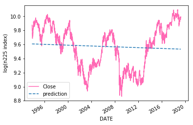


```python
results.resid.hist(color='lightgray')
plt.xlabel('residual')
plt.ylabel('frequency')
```


    Text(0, 0.5, 'frequency')


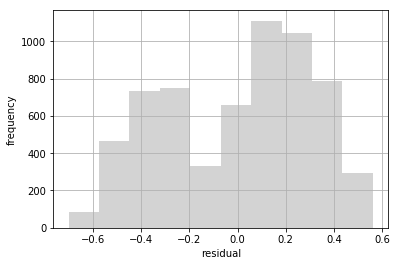


|景気(states)|期間-始点|終点|リターン|ボラティリティ|回帰係数|切片|残差標準偏差|
|:---:|:---:|:---:|---:|:---:|:---:|:---:|:---:|
|戦後復興期(recover)|1949/5/16|1954/11/30    |14%|23%|0.0011|4.5236|0.2537|
|高度経済成長期(growth)|1954/12/1|1971/12/31 |13%|14%|0.0004|6.1675|0.2278|
|安定期(stable)|1972/1/1|1986/11/30         |11%|13%|0.0004|8.1001|0.1263|
|バブル経済期(bubble)|1986/12/1|1993/10/31    | 3%|23%|-0.0002|10.2897|0.2025|
|バブルのピークまで|1986/12/1|1989/12/31     |26%|18%|0.0008|9.9122|0.05441|
|経済変革期(reform)|1993/10/31|現在            | 1%|24%|-0.0001|9.7276|0.2647|


```python

```
