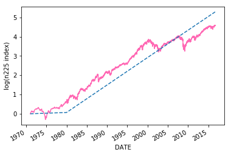
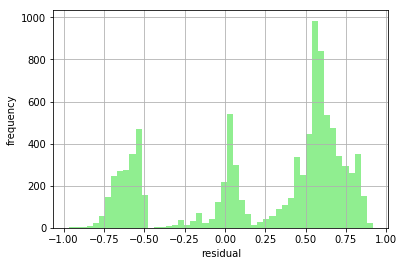

# 第7章 確率的トレンドとは何か？
## 7.4 ランダムウォークの判定


```python
%matplotlib inline
import matplotlib.pyplot as plt
import statsmodels.api as sm
import pandas_datareader.data as web
import numpy as np
end='2017/12/30'
lnn225 = np.log(web.DataReader("NIKKEI225", 'fred',"1949/5/16",end)).dropna()
```


```python
print(sm.tsa.adfuller(lnn225.NIKKEI225,regression='nc')[0])#検定統計量
print(sm.tsa.adfuller(lnn225.NIKKEI225,regression='nc')[1])#p-値
print(sm.tsa.adfuller(lnn225.NIKKEI225,regression='nc')[2])#ラグの数
print(sm.tsa.adfuller(lnn225.NIKKEI225,regression='nc')[3])#データの数
print(sm.tsa.adfuller(lnn225.NIKKEI225,regression='nc')[4])#臨界値
```

    2.36183081396164
    0.9968769754542945
    38
    17038
    {'1%': -2.565871236816357, '5%': -1.9410157763465283, '10%': -1.6168044206599144}
    


```python
print(sm.tsa.adfuller(lnn225.NIKKEI225,regression='ct')[1])
```

    0.7968451722029597
    


```python
print(sm.tsa.adfuller(lnn225.NIKKEI225,regression='c')[1])
```

    0.13620836082381582
    


```python
print(sm.tsa.adfuller(lnn225.NIKKEI225,regression='c')[3])
```

    17050
    


```python
print(sm.tsa.adfuller(lnn225.NIKKEI225,regression='c')[4])
```

    {'1%': -3.430733594415799, '5%': -2.8617095336343805, '10%': -2.5668602384018024}
    


```python
print(sm.tsa.adfuller(lnn225.NIKKEI225,regression='c')[:2])
```

    (-2.4198635880674595, 0.13620836082381582)
    


```python
print(sm.tsa.adfuller(lnn225.NIKKEI225,regression='nc')[1])
```

    0.9968769754542945
    


```python
print(sm.tsa.adfuller(lnn225.NIKKEI225.loc[:'1954/11/30'],regression='ct')[1])
```

    0.504338667971144
    


```python
print(sm.tsa.adfuller(lnn225.NIKKEI225.loc[:'1954/11/30'],regression='c')[1])
```

    0.9030869245267042
    


```python
print(sm.tsa.adfuller(lnn225.NIKKEI225.loc[:'1954/11/30'],regression='nc')[1])
```

    0.8958220015711225
    


```python
print(sm.tsa.adfuller(lnn225.NIKKEI225.loc['1954/12/1':'1971/12/31'],regression='ct')[1])
```

    0.6155882082555593
    


```python
print(sm.tsa.adfuller(lnn225.NIKKEI225.loc['1954/12/1':'1971/12/31'],regression='c')[1])
```

    0.4800438633314258
    


```python
print(sm.tsa.adfuller(lnn225.NIKKEI225.loc['1954/12/1':'1971/12/31'],regression='nc')[1])
```

    0.9996897545994142
    


```python
print(sm.tsa.adfuller(lnn225.NIKKEI225.loc['1972/1/1':'1986/11/30'],regression='ct')[1])
```

    0.8402409372975902
    


```python
print(sm.tsa.adfuller(lnn225.NIKKEI225.loc['1972/1/1':'1986/11/30'],regression='c')[1])
```

    0.9617553773603689
    


```python
print(sm.tsa.adfuller(lnn225.NIKKEI225.loc['1972/1/1':'1986/11/30'],regression='nc')[1])
```

    0.9999969918866995
    


```python
print(sm.tsa.adfuller(lnn225.NIKKEI225.loc['1986/12/1':'1989/12/31'],regression='ct')[1])
```

    0.312378263485677
    


```python
print(sm.tsa.adfuller(lnn225.NIKKEI225.loc['1986/12/1':'1989/12/31'],regression='c')[1])
```

    0.7683779392790114
    


```python
print(sm.tsa.adfuller(lnn225.NIKKEI225.loc['1986/12/1':'1989/12/31'],regression='nc')[1])
```

    0.9995251300452263
    


```python
print(sm.tsa.adfuller(lnn225.NIKKEI225.loc['1986/12/1':'1993/10/30'],regression='ct')[1])
```

    0.408168347819885
    


```python
print(sm.tsa.adfuller(lnn225.NIKKEI225.loc['1986/12/1':'1993/10/30'],regression='c')[1])
```

    0.6141943333114527
    


```python
print(sm.tsa.adfuller(lnn225.NIKKEI225.loc['1986/12/1':'1993/10/30'],regression='nc')[1])
```

    0.7140907722196173
    


```python
print(sm.tsa.adfuller(lnn225.NIKKEI225.loc[:'1993/10/30'],regression='ct')[1])
```

    0.6200868232542235
    


```python
print(sm.tsa.adfuller(lnn225.NIKKEI225.loc[:'1993/10/30'],regression='c')[1])
```

    0.6520083640509098
    


```python
print(sm.tsa.adfuller(lnn225.NIKKEI225.loc[:'1993/10/30'],regression='nc')[1])
```

    0.999821116797176
    


```python
print(sm.tsa.adfuller(lnn225.NIKKEI225.loc['1993/10/30':],regression='ct')[1])
```

    0.8897077994987306
    


```python
print(sm.tsa.adfuller(lnn225.NIKKEI225.loc['1993/10/30':],regression='c')[1])
```

    0.5097432442170079
    


```python
print(sm.tsa.adfuller(lnn225.NIKKEI225.loc['1993/10/30':],regression='nc')[1])
```

    0.7299929655705061
    


```python
print(sm.tsa.adfuller(lnn225.NIKKEI225.loc['1990/1/1':'1992/8/31'],regression='nc')[1])
```

    0.07395551634727046
    


```python
print(sm.tsa.adfuller(lnn225.NIKKEI225.loc['1990/1/1':'1992/8/31'],regression='c')[1])
```

    0.4428061763549331
    


```python
print(sm.tsa.adfuller(lnn225.NIKKEI225.loc['1990/1/1':'1992/8/31'],regression='ct')[1])
```

    0.3234146331128931
    


```python
z=lnn225
y=z.diff().dropna()
x=z.shift(1).dropna()
model=sm.OLS(y,x)
results=model.fit()
print("without drift  ",results.params[0])
x=sm.add_constant(x)
model=sm.OLS(y,x)
results=model.fit()
print("with drift  ",results.params[0],results.params[1])
x["t"]=range(len(y))
model=sm.OLS(y,x)
results=model.fit()
print("with drift + time trend  ",results.params[0],results.params[1],results.params[2])
```

    without drift   2.8308544317879365e-05
    with drift   0.0015130273381139573 -0.00014520004266660355
    with drift + time trend   0.0016885747083524867 -0.0001771150695686568 1.1062080558736088e-08
    

##### 結果の解説

日経株価平均の1949年以降のデータを用いた単位根検定では結果は0.54である。これは危険域を10%とするとそれよりも高いので、帰無仮説を棄却できない。よってドリフト付きランダムウォークである。

|景気(states)|期間-始点|終点                  |単純ランダムウォーク|ドリフト付き| ドリフト＋時間トレンド|
|:---:|:---:|:---:                            |:---:|:---:|:---:|
|全期間||                                     |0.99|0.09|0.84|
|戦後復興期(recover)|1949/5/16|1954/11/30     |0.89|0.90|0.50|
|高度経済成長期(growth)|1954/12/1|1971/12/31  |0.99|0.48|0.62|
|安定期(stable)|1972/1/1|1986/11/30          |1.00|0.96|0.84|
|バブル経済期(bubble)|1986/12/1|1993/10/30     |0.71|0.61|0.41|
|バブルピークまで　　|1986/12/1|1989/12/31     |1.00|0.77|0.31|
|経済変革期(reform)|1991/3/1|現在             |0.63|0.34|0.76|


```python
z=lnn225.loc[:"1954/11/30"]
y=z.diff().dropna()
x=z.shift(1).dropna()
model=sm.OLS(y,x)
results=model.fit()
print("nc  ",results.params)
x=sm.add_constant(x)
model=sm.OLS(y,x)
results=model.fit()
print("c  ",results.params[0],results.params[1])
x["t"]=range(len(y))
model=sm.OLS(y,x)
results=model.fit()
print("ct  ",results.params[0],results.params[1],results.params[2])
```

    nc   NIKKEI225    0.000082
    dtype: float64
    c   0.0010158563190787962 -0.00010764780610967597
    ct   0.01545583437899823 -0.0034833277649627867 5.007360047870146e-06
    


```python
z=lnn225.loc["1954/11/30":'1971/12/31']
y=z.diff().dropna()
x=z.shift(1).dropna()
model=sm.OLS(y,x)
results=model.fit()
print("nc  ",results.params)
x=sm.add_constant(x)
model=sm.OLS(y,x)
results=model.fit()
print("c  ",results.params[0],results.params[1])
x["t"]=range(len(y))
model=sm.OLS(y,x)
results=model.fit()
print("ct  ",results.params[0],results.params[1],results.params[2])
```

    nc   NIKKEI225    0.000068
    dtype: float64
    c   0.003545221183422896 -0.0004344520457164285
    ct   0.007763804026229211 -0.0011394052321696568 3.41862728774835e-07
    


```python
z=lnn225.loc['1971/12/31':'1986/11/30']
y=z.diff().dropna()
x=z.shift(1).dropna()
model=sm.OLS(y,x)
results=model.fit()
print("nc  ",results.params)
x=sm.add_constant(x)
model=sm.OLS(y,x)
results=model.fit()
print("c  ",results.params[0],results.params[1])
x["t"]=range(len(y))
model=sm.OLS(y,x)
results=model.fit()
print("ct  ",results.params[0],results.params[1],results.params[2])
```

    nc   NIKKEI225    0.000057
    dtype: float64
    c   0.0005944909970093167 -1.0333006186347615e-05
    ct   0.012677919948123034 -0.0015148449034599579 6.087432002879677e-07
    


```python
z=lnn225.loc['1986/11/30':'1993/10/31']
y=z.diff().dropna()
x=z.shift(1).dropna()
model=sm.OLS(y,x)
results=model.fit()
print("nc  ",results.params)
x=sm.add_constant(x)
model=sm.OLS(y,x)
results=model.fit()
print("c  ",results.params[0],results.params[1])
x["t"]=range(len(y))
model=sm.OLS(y,x)
results=model.fit()
print("ct  ",results.params[0],results.params[1],results.params[2])
```

    nc   NIKKEI225    0.000003
    dtype: float64
    c   0.022443821648993646 -0.002216483721531165
    ct   0.04373213020351292 -0.004158909633475783 -1.9440246375722545e-06
    


```python
z=lnn225.loc['1986/11/30':'1989/12/31']
y=z.diff().dropna()
x=z.shift(1).dropna()
model=sm.OLS(y,x)
results=model.fit()
print("nc  ",results.params)
print("nc  ",results.aic)
print("nc  ",results.bic)
print("nc  ",results.rsquared)
print("nc  ",results.rsquared_adj)
print("nc  ",results.mse_resid)
print("nc  ",results.eigenvals)
x=sm.add_constant(x)
model=sm.OLS(y,x)
results=model.fit()
print("c  ",results.params[0],results.params[1])
print("c  ",results.aic)
print("c  ",results.bic)
print("c  ",results.rsquared)
print("c  ",results.rsquared_adj)
print("c  ",results.mse_resid)
print("c  ",results.eigenvals)
x["t"]=range(len(y))
model=sm.OLS(y,x)
results=model.fit()
print("ct  ",results.params[0],results.params[1],results.params[2])
print("ct  ",results.aic)
print("ct  ",results.bic)
print("ct  ",results.rsquared)
print("ct  ",results.rsquared_adj)
print("ct  ",results.mse_resid)
print("ct  ",results.eigenvals)

```

    nc   NIKKEI225    0.000096
    dtype: float64
    nc   -4690.719227375498
    nc   -4686.080659586331
    nc   0.0075452699572642334
    nc   0.006244542919200291
    nc   0.00012604520290183932
    nc   [79769.67617582]
    c   0.027357796331482866 -0.0025811995541897845
    c   -4690.194921649443
    c   -4680.91778607111
    c   0.001793776010617254
    c   0.000483794089371381
    c   0.00012596707136128813
    c   [8.05334306e+04 2.45603153e-01]
    ct   0.22786812894269043 -0.022869218461063576 1.7724839579405617e-05
    ct   -4696.349822253934
    ct   -4682.434118886435
    ct   0.01239192032541836
    ct   0.009796366896575925
    ct   0.00012479342603525405
    ct   [1.48417739e+08 1.89889943e+04 2.27656103e-02]
    


```python
z=lnn225.loc['1993/10/31':]
y=z.diff().dropna()
x=z.shift(1).dropna()
model=sm.OLS(y,x)
results=model.fit()
print("nc  ",results.params)
x=sm.add_constant(x)
model=sm.OLS(y,x)
results=model.fit()
print("c  ",results.params[0],results.params[1])
x["t"]=range(len(y))
model=sm.OLS(y,x)
results=model.fit()
print("ct  ",results.params[0],results.params[1],results.params[2])
```

    nc   NIKKEI225    0.000002
    dtype: float64
    c   0.011510019021973947 -0.0012026888545815446
    ct   0.009991407373640186 -0.001073907600308289 9.735325306611057e-08
    


```python
z=lnn225.loc['1990/1/1':'1992/8/31']
y=z.diff().dropna()
x=z.shift(1).dropna()
model=sm.OLS(y,x)
results=model.fit()
print("nc  ",results.params)
x=sm.add_constant(x)
model=sm.OLS(y,x)
results=model.fit()
print("c  ",results.params[0],results.params[1])
x["t"]=range(len(y))
model=sm.OLS(y,x)
results=model.fit()
print("ct  ",results.params[0],results.params[1],results.params[2])
```

    nc   NIKKEI225   -0.000118
    dtype: float64
    c   0.05597067096577461 -0.005660275781029749
    ct   0.20701597961246376 -0.020029652526247388 -1.8352425875116774e-05
    

## 7.5 確定的トレンドと確率的トレンド


```python
%matplotlib inline
import matplotlib.pyplot as plt
import statsmodels.api as sm
import pandas_datareader.data as pdr
import numpy as np
end='2016/9/30'
lnw5000 = np.log(web.DataReader("WILL5000INDFC", 'fred',"1949/5/16",end)).dropna()
lnw5000.columns=['Close']
plt.plot(lnw5000.Close,color='hotpink')
lnw5000["t"]=range(len(lnw5000))
model=sm.OLS(lnw5000.Close,lnw5000.t)
results=model.fit()
results.fittedvalues.plot(label='prediction',style='--')
plt.ylabel('log(n225 index)')
```


    Text(0, 0.5, 'log(n225 index)')





```python
results.resid.hist(bins=50,color='lightgreen')
plt.ylabel('frequency')
plt.xlabel('residual')
```


    Text(0.5, 0, 'residual')





```python
print(results.summary())
```

                                OLS Regression Results                            
    ==============================================================================
    Dep. Variable:                  Close   R-squared:                       0.967
    Model:                            OLS   Adj. R-squared:                  0.967
    Method:                 Least Squares   F-statistic:                 2.770e+05
    Date:                Mon, 15 Apr 2019   Prob (F-statistic):               0.00
    Time:                        11:36:21   Log-Likelihood:                -7929.6
    No. Observations:                9397   AIC:                         1.586e+04
    Df Residuals:                    9396   BIC:                         1.587e+04
    Df Model:                           1                                         
    Covariance Type:            nonrobust                                         
    ==============================================================================
                     coef    std err          t      P>|t|      [0.025      0.975]
    ------------------------------------------------------------------------------
    t              0.0006   1.07e-06    526.352      0.000       0.001       0.001
    ==============================================================================
    Omnibus:                     2185.621   Durbin-Watson:                   0.000
    Prob(Omnibus):                  0.000   Jarque-Bera (JB):             1204.052
    Skew:                          -0.744   Prob(JB):                    3.50e-262
    Kurtosis:                       2.071   Cond. No.                         1.00
    ==============================================================================
    
    Warnings:
    [1] Standard Errors assume that the covariance matrix of the errors is correctly specified.
    
