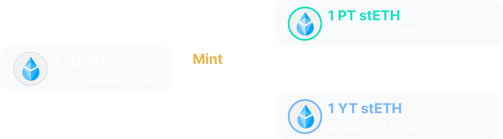

Pendle's Ultimate Guide to Become a Profitable Yield Master
# getting started
In DeFi, you put your assets into a yield farming pool, and get an APY that fluctuates over time. Now with Pendle, you can do some DeFi magic and potentially get a much higher APY (by multiples) if you do it right. This DeFi magic is called yield trading, and this guide is all you need to become a master at it. This guide is divided into 4 levels of understanding. The more levels you could master, the more profitable you could become!

# 1 Yield Tokenisation
When you stake a token in any DeFi protocol, you will receive some amount of yield. Let's say 100 DAI is staked in Compound for 3 months. During that period, you will receive yield in DAI and COMP.

In Pendle, the staked DAI position can be separated into two components: PT and YT.


By holding PT (Principal Token), Peepo can redeem the principal amount after maturity, which would be after 3 months in this case.


By holding YT (Yield Token), Peepo continuously receives the yield of the staked token during the entire duration of 3 months.

If you want to understand yield tokenisation more, scroll down to read the rest of Level 1. Otherwise, you can jump to Level 2 TL;DR.

## Level 1.1 What is yield tokenisation?
The 100 DAI staked in Compound is a yield-bearing position. Nearly every pool in DeFi gives you a yield-bearing position in return for staking or depositing tokens. Other examples include stETH from Lido or LOOKS staked in LooksRare.
In Pendle, the yield-bearing position can be split into two components: YT --> representing just the yield of the position, and PT --> representing the principal amount.
When yield is tokenised, there is a maturity associated with the tokenisation, demonstrated below.


## Level 1.2 What are PT and YT exactly?
For every yield-bearing position, there is an underlying asset.
```
The underlying asset is used as a unit to value a yield-bearing position and calculate its APY.
```
The underlying asset is usually very obvious: like DAI in "DAI staked in Compound" or LOOKS in "LOOKS staked in LooksRare". With that, here's the exact definitions of PT and YT:
```
1 PT gives you the right to redeem 1 unit of the underlying asset upon maturity.
```
```
1 YT gives you the right to receive yield on 1 unit of the underlying asset from now until maturity, claimable in real-time.
```
Let's look at a few examples, in numbers:


## Level 1.3 What can you do with PT and YT?
A
Before maturity
you can mint 1 PT and 1 YT from 1 unit of the underlying asset.
Mint action before maturity

B
Before maturity
you can redeem 1 unit of underlying asset from 1 PT + 1 YT.
Redeeming underlying asset before maturity

C
Before maturity
YT holders can claim any accrued yield in real-time.
Claiming accrued yield before maturity

D
After maturity
PT holders can redeem underlying asset 1:1 without YT.
Redeeming underlying asset without YT after maturity

E
Anytime
You can buy and sell PT and YT on the open market using Pendle AMM.
As such, PT and YT will always have a market price. We will talk more about trading PT and YT in the next levels.

## Level 1.4
The PT / YT equation
Since 1 unit of underlying asset mints 1 PT + 1 YT and 1 PT + 1 YT redeems for 1 unit of underlying asset, there is an obvious relationship between their prices:
```
PT Price + YT Price = Underlying Asset Price
```
The Pendle AMM ensures that this relationship holds true at all times.

# 2 Fixing Your Yield - The PT Trade
You can buy or sell Principal Token (PT) on the Pendle AMM. PT price is determined by market demand and supply.

Peepo is buying PT for DAI staked in Compound, known as PT cDAI. Because PT cDAI does not include the yield component, PT cDAI will always be cheaper than 1 DAI. This is true for all PT.
After buying 1 PT cDAI at a discounted price (0.9DAI), Peepo can redeem 1 DAI for his PT upon maturity. This is a fixed return, since the amount of DAI redeemable at maturity is fixed.

What we described is basically the PT trade:
Buying and holding PT until maturity = receiving fixed yield.
If you want to understand the PT trade more, scroll down to read the rest of Level 2. Otherwise, you can jump to Level 3 TL;DR.


## Level 2.1 When should you buy PT?
The fixed yield from buying and holding PT is dependent on the market and current PT price.
Intuitively, you should buy PT when it is cheaper, as you would get a higher fixed yield. But how can you tell that PT is selling at a cheap price?
There are two steps in your consideration:
```
1. Your prediction of the average future yield from now until maturity
```
```
2. Given your prediction, is the current fixed yield good enough to lock in?
```
For example, you predict that the average future yield until maturity for stETH is 5%, but PT stETH is priced at a 6% fixed rate => You should buy and hold PT stETH.
PRO TIP
```
Timing is important in executing a PT trade. As people buy and sell PT in Pendle, the fixed rate will fluctuate up and down. If you can wait and enter the PT trade right when PT is oversold (due to volatility or mispricing), you will have locked in a high fixed rate all the way until maturity.
```
## Level 2.2 Early selling of PTs
Instead of waiting until maturity to redeem the underlying asset, you can also choose to sell your PT prematurely. The usual motivations for selling PTs are:
 Exiting the position to move capital elsewhere
 PT price has increased significantly and there is an opportunity to take profit early. This is known as Active Yield Trading, and we will discuss this later on.

##  Level 2.3 How it works in practice
Let's say that there is a stETH pool in Pendle with a maturity of 1 year. That means the holder of PT stETH can redeem stETH 1:1 after 1 year.
Peepo sees the following information from the Pendle Market page on 01 Jan 20023:
Happy PeepoLaptop screen showing Pendle Markets
Example of stETH market

PT stETH = 0.94 stETH
You can pay 0.94 stETH to buy 1 PT stETH now and redeem 1 stETH after maturity

Underlying APY = 5%
Underlying APY means that stETH is currently generating a 5% yield from staking rewards in Lido. Thus holding stETH nets a 5% APY.

Fixed APY = 6.4%
Fixed APY for buying and holding PT until maturity is 6.4%
Peepo predicts that the average future yield in Lido will at best be 6%, so locking in a 6.4% fixed yield is a good move. Peepo proceeds to purchase 100 PT stETH (= 94 stETH). Having purchased 100 PT stETH, Peepo is guaranteed to be able to redeem 100 stETH after the PT matures in 1 year, giving him a Fixed APY of 6.4%.
Example of Peepo executing a PT trading strategy


This is an excellent rate for fixed returns, and even if the Fixed APY was slightly lower than the Underlying APY, it might still be a good deal, especially if you predict that yield will drop in the future. This is especially useful in turbulent markets when the yield can fluctuate rapidly, as you can fix your APY at a desirable rate and not need to worry about your returns at all.

# 3 Longing Yield - The YT Trade


TL;DR
Yield Tokens (YT) are traded on the Pendle AMM in the same pool as Principal Tokens (PT).

Diagram showing trading of Principal Tokens (PT) and Yield Tokens (YT) on the Pendle AMM
Let's say 1 YT stETH is trading at 0.04 stETH, with a maturity in 1 year. Holding 1 YT stETH gives you the right to receive the yield on 1 stETH until maturity.
Peepo thinks that 1 stETH will generate more than 0.04 stETH yield in 1 year (equivalent to 4% APY), and chooses to buy 1 YT stETH.

Example of Peepo buying YT and collecting accrued yield
Here, Peepo profits as the future yield that he accrued is greater than the price of YT stETH when he purchased it. Peepo was basically longing stETH yield, and this is the second yield trading strategy:
```
Buying and holding YT = longing yield
Profits = future yield - YT cost
```
If you want to understand the YT trade more, scroll down to read the rest of Level 3. Otherwise, you can jump to Level 4 TL;DR.
## Level 3.1 When should you long yield and buy YT?
The last statement in the previous section can be condensed into a formula:

Profit equation in terms of future yield and YT price
* The best way to frame yield trading is to think in terms of APY instead of absolute values.
If you think the average future APY will be higher than the current Implied APY (the APY that the market is implying), then longing yield is a sound strategy.
One simple estimate of the average future APY is the current underlying APY, which is the APY being generated in the underlying protocol. If all the conditions stay exactly the same from now until maturity, the future APY should be the same as the underlying APY.
If you assume that the current underlying APY is a good estimate of future APY, these are simple guidelines to see when is a good time to purchase YT:
If Implied APY is low compared to Underlying APY, then you are more likely to profit from buying YT.
If Implied APY is high compared to Underlying APY, then you are less likely to profit from buying YT.
## Level 3.2 How can you predict average future APY?
The simple guidelines in the previous section have a big assumption that the underlying APY will stay the same.
Of course, reality is not so simple and this usually is not the case. Many other factors can influence the future yield, such as market sentiment or changes to the yield generating mechanism of the underlying protocol.
For example, in a bull market, there is a high demand for money, resulting in a higher rate of borrowing in money markets. This demand will translate to higher borrowing APY, and thus higher APY for lenders. Any edge in identifying and analysing these trends will go a long way in predicting future yield and executing this strategy.
Compound lending rates (7-day moving average)

## Level 3.3 How it works in practice?
Let's say that there is a stETH pool in Pendle with a maturity of 1 year. That means the holder of YT stETH has the right to collect stETH yield for the next 1 year.
Peepo sees the following information from the Pendle Market page on 01 Jan 2023:
Happy PeepoLaptop screen showing Pendle Markets
Example of stETH market

YT stETH = 0.04 stETH
Implied APY = 4.2%
By trading YT stETH at this price, the market is valuing the average future APY of stETH to be 4.2% in the next year.
Underlying APY = 5%
Underlying APY means that stETH is currently generating a 5% yield from staking rewards in Lido. Thus holding stETH nets a 5% APY.
Long Yield APY = 25%
APY for buying and holding YT at the current price, assuming the average future APY is equivalent to the current underlying APY.
Peepo predicts that the average future APY of stETH will remain above 5%, meaning that the current Implied APY of 4.2% is a bargain.
Peepo chooses to buy 100 YT stETH (= 4 stETH), knowing that if the average future APY remains at the current underlying APY (which is a possible assumption), he will receive 5 stETH worth of yield, netting a 25% APY.
Example of Peepo planning a YT trading strategy with reference to the estimated Long Yield APY
It turns out that the average APY increases to 5.5% within the next year, Peepo ends up receiving an even greater yield.
Example of Peepo executing a YT trading strategy
Compared to simply holding stETH, which would receive the displayed 5.5% APY, Peepo receives more than 6x of that APY by holding YT stETH instead.
Wojak in tears
Wojak bought 4 stETH
By holding 4 stETH for 1 year, Wojak earned 5.5% APY = 0.22 stETH
Happy Peepo
Peepo bought 100 YT stETH (=4 stETH)
By holding 100 YT stETH for 1 year, Peepo earned 1.5 stETH. Peepo receives more than 6x of that APY by holding stETH instead.
However, it is important to note that, as with most investments, higher rewards comes with higher risks.
When Implied Yield > Underlying APY, then Long Yield APY will be negative. This means that assuming the underlying APY remains constant, the cost of buying YT would be more than the average future yield collected. When under such scenario, it is generally not a good time to buy YT, unless you believe that the underlying APY will rise significantly in the short term.
Even when you buy YT at a positive Long Yield APY when Implied APY < Underlying APY, the average future APY could drop lower than the Implied APY of your trade and you will have a loss (look at the equation in section 3.1 again).
Ultimately, you are longing yield and your profit depends on yield sustaining or increasing.

# 4 Yield Trading

TL;DR
The objective of this strategy is to maximise your APY on the underlying asset by switching between the 2 possible positions:
1. Hold PT (short yield)
2. Hold YT (long yield)
Since yields in DeFi are constantly fluctuating, Implied APY on Pendle markets also fluctuates.
As Implied APY fluctuates, the market will swing between two modes:
Market swing between Cheap PT Mode and Cheap YT Mode
Hence, if you can time the market well and alternate between selling and buying PT and YT, you can potentially get greater profits. This is essentially swing trading for yield. However, if you are unsure of the yield movements, you can also simply hold the underlying asset to hedge against both sides.
Compound lending rates (7-day moving average)
Level 4.1
The three modes of a Pendle yield market
CHEAP PT MODE
Implied APY is high
PT is cheap
YT is expensive
When Implied APY is high (overvalued), PT is cheap with a high fixed APY, holding PT tends to be the best strategy.
When holding PT:
If the market swings and Implied APY falls, examine the Implied APY to determine which mode the market has morphed into, and execute the relevant strategies.
If all else stays constant, you can hold PT until maturity and redeem the underlying asset, realising the Fixed APY (see Level 2 for fixed yield strategy).
EQUILIBRIUM MODE
Implied APY is reasonable
PT price is reasonable
YT price is reasonable
When Implied APY is at a reasonable rate, it means that PT and YT prices are both reasonable and the market is at an equilibrium.
As such, any of the three strategies (holding PT, holding YT, or holding the underlying asset) are all potentially sound.
CHEAP YT MODE
Implied APY is low
PT is expensive
YT is cheap
When Implied APY is low (undervalued), YT is cheap with a high Long Yield APY, holding YT tends to be the best strategy.
When holding YT:
If the market swings and Implied APY rises, examine the Implied APY to determine which mode the market has morphed into, and execute the relevant strategies.
If all else stays constant, you can hold YT until maturity and continue collecting the yield of the asset.
Level 4.2
How to identify the correct mode
The key to identifying the mode is to judge whether the current Implied APY is overvalued or undervalued.
To recap, Implied APY is the average future APY that the market is implying by trading PT and YT at the current prices.
It boils down to predicting the average future APY, then comparing your predictions with the current Implied APY. In many cases, it is reasonable to approximate the average future APY to the underlying APY.
However, yield can fluctuate by large amounts in rare cases, and the underlying APY might deviate significantly from the actual average future APY.
For example, if a protocol has announced an upcoming APY reduction, the market will likely have priced it in, resulting in a seemingly low Implied Yield and cheap YT.
Ultimately, the deciding factor is your own outlook on the average future APY that guides your decisions and determines your success in yield trading.
Level 4.3
How it works in practice
Suppose it is 1 Jan 2023, and there is an stETH market on Pendle with a 1 year maturity period (1 Jan 2024).
On 1 Jan 2023 (1 year till maturity):
Example stETH market - 1 year until maturity
Happy Peepo
Based on his predictions, Peepo believes that the average future APY for stETH for the coming year will be 5.5%. Therefore, to Peepo, the market is in cheap YT mode (Implied APY of 4.5% is undervalued) and buys 100 YT stETH, costing him 4.3 stETH.
On 1 April 2023 (9 months till maturity):
Example stETH market - 9 months until maturity
Happy Peepo
So far, the average APY since 1st Jan has been stable at 5%. As such, Peepo has received a yield of 1.23 stETH from holding YT so far.
Now, looking at the market, Peepo revises his prediction for the average future APY to 5.3%. With the Implied Yield higher than his prediction and Long Yield APY in the negatives, Peepo interprets the market as being in cheap PT Mode and sells his YT for PT.
First, Peepo sells 100 YT stETH for 3.93 stETH.
His position is worth 3.93 + 1.23 (yield) = 5.15 stETH in total, which is a 107% APY in the first quarter. This is due to the higher price of YT, as seen from the increase in Implied APY, as well as the higher average APY compared to the Implied APY when he purchased YT.
Then, Peepo converts all his 5.15 stETH to 5.37 PT stETH.
On 1 Oct 2023 (3 months till maturity):
Example stETH market - 3 months until maturity
Happy Peepo
Peepo maintains his prediction of 5.3% average future APY, and so believes that the market is in equilibrium (even though Implied APY > Underlying APY). He chooses to exit his position and simply hold stETH.
Peepo sells his 5.37 PT stETH into 5.301 stETH. From April, he has netted about 0.151 stETH, translating to 6.0% APY thanks to PT being priced higher at a lower Implied APY.
In total, after 9 months, Peepo executed 3 trades and has 5.301 stETH from a starting principal of 4.3 stETH. This translates into an APY of 32.2%.
Obviously, the more correct trades Peepo executes, the larger his APY. We can also observe that correct YT trades can lead to large profits. Of course, the inverse is also true, that wrong YT trades can lead to large losses. PT trades, on the other hand, will be lower risk, and lower reward as well.
PRO TIP
On top of Implied APY changes due to overall market conditions, there are Implied APY changes simply due to volatility as people buy and sell PT and YT. You can actively trade these movements and switch between PT / YT much more often, which could give larger profits if you do it right.
