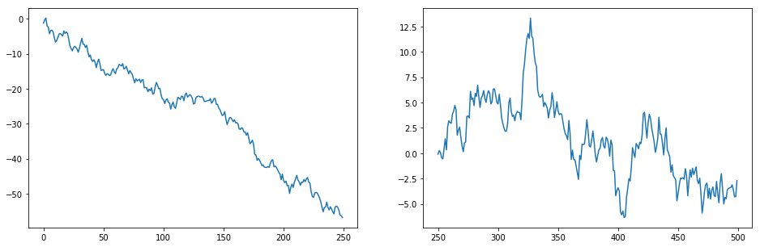
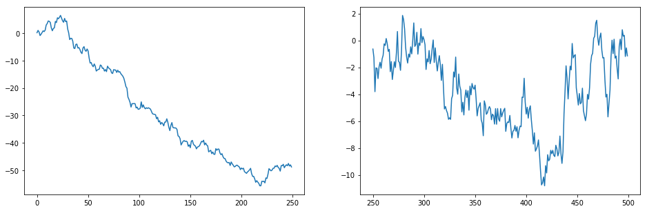
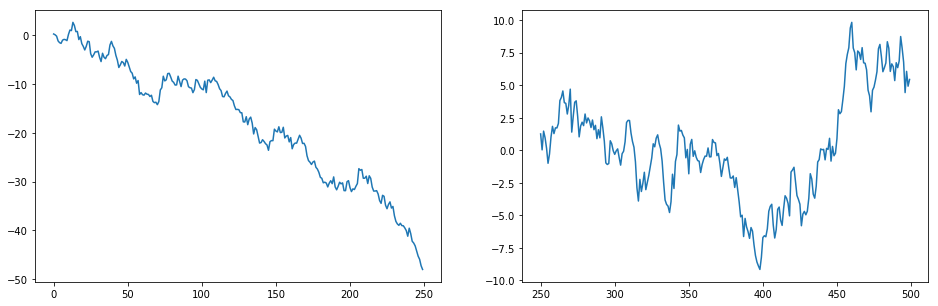

```python
#【手把手教你】玩转Python量化金融工具之NumPy
import numpy as np
```


```python
a=[1,2,3,4,5,6,7,8]             #a是系列(list)
b=np.array(a)           #b是数组
print(a,b)              #打印a和b
print(type(a),type(b))  #查看a和b的类型
```

    [1, 2, 3, 4, 5, 6, 7, 8] [1 2 3 4 5 6 7 8]
    <class 'list'> <class 'numpy.ndarray'>


```python
b=b.reshape(2,4)      #改变数组的维度
print(b)              #从原来的1x8变成2x4 （两行四列）
#元素访问
print("取第1行第2列元素：",b[1][2])  #注意是从0行0列开始数！！！
```

    [[1 2 3 4]
     [5 6 7 8]]
    取第1行第2列元素： 7


```python
#变成三维数组：
c=b.reshape(2,2,2)
print(c)
```

    [[[1 2]
      [3 4]]
    
     [[5 6]
      [7 8]]]


```python
#特殊的数组有特别定制的命令生成，如零和1矩阵:
d=(3,4)
print(np.zeros(d))          #零矩阵
print(np.ones(d))
#默认生成的类型是浮点型，可以通过指定类型改为整型
print(np.ones(d,dtype=int))
```

    [[0. 0. 0. 0.]
     [0. 0. 0. 0.]
     [0. 0. 0. 0.]]
    [[1. 1. 1. 1.]
     [1. 1. 1. 1.]
     [1. 1. 1. 1.]]
    [[1 1 1 1]
     [1 1 1 1]
     [1 1 1 1]]


```python
#使用range产生list
L=[i for i in a]
print(L)
```

    [1, 2, 3, 4, 5, 6, 7, 8]


```python
b=np.arange(10)     #注意包含0，不包含10
c=np.arange(0,10,2) #2表示间隔
d=np.arange(1,10,3) #3表示间隔
print(b,c,d)
```

    [0 1 2 3 4 5 6 7 8 9] [0 2 4 6 8] [1 4 7]


```python
a=np.random.rand(3,4)      #创建指定为3行4列)的数组(范围在0至1之间)
b=np.random.uniform(0,100) #创建指定范围内的一个数
c=np.random.randint(0,100) #创建指定范围内的一个整数
print("创建指定为3行4列)的数组：\n",a)   #\n 表示换行
print("创建指定范围内的一个数：%.2f" %b) #%.2f 表示结果保留2位小数
print("创建指定范围内的一个整数：",c)
```

    创建指定为3行4列)的数组：
     [[0.24290786 0.29126565 0.22954216 0.71237377]
     [0.90865224 0.96138482 0.23537074 0.30714666]
     [0.24552398 0.09711422 0.93611258 0.17780533]]
    创建指定范围内的一个数：22.71
    创建指定范围内的一个整数： 35


```python
#正态生成3行4列的二维数组
a= np.random.normal(1.5, 3, (3, 4))  #均值为1.5，标准差为3
print(a)
# 截取第1至2行的第2至3列(从第0行、0列算起算起)
b = a[1:3, 2:4]
print("截取第1至2行的第2至3列: \n",b)
```

    [[ 7.12065991  4.89900036  6.33525156  4.94284594]
     [ 1.75049261  1.70911233 -2.82518577  6.2544184 ]
     [ 1.24670261  0.11669276 -0.59999725  3.97664108]]
    截取第1至2行的第2至3列: 
     [[-2.82518577  6.2544184 ]
     [-0.59999725  3.97664108]]


```python
a = np.array([1,2,3,4]) #1行4列
b = np.array(2)         #只有一个元素
```


```python
a - b,a+b
```


    (array([-1,  0,  1,  2]), array([3, 4, 5, 6]))


```python
print(a)
```

    [1 2 3 4]


```python
print(b)
```

    2


```python
a**2  #二次方，a里元素的平方
```


    array([ 1,  4,  9, 16])


```python
np.sqrt(a)  #开根号
```


    array([1.        , 1.41421356, 1.73205081, 2.        ])


```python
np.exp(a)  #e 求方
```


    array([ 2.71828183,  7.3890561 , 20.08553692, 54.59815003])


```python
np.floor(10*np.random.random((2,2))) #向下取整
```


    array([[8., 4.],
           [8., 2.]])


```python
a.resize(2,2) #变换结构
```


```python
print(a)
```

    [[1 2]
     [3 4]]


```python
a
```


    array([[1, 2],
           [3, 4]])


```python
a=np.arange(20).reshape(4,5)
print("原数组a:\n",a)
print("a全部元素和: ", a.sum())
print("a的最大值: ", a.max())
print("a的最小值: ", a.min())
print("a每行的最大值: ", a.max(axis=1))  #axis=1代表行
print("a每列的最大值: ", a.min(axis=0))  #axis=0代表列
print("a每行元素的求和: ", a.sum(axis=1)) 
print("a每行元素的均值：",np.mean(a,axis=1))
print("a每行元素的标准差：",np.std(a,axis=1))
```

    原数组a:
     [[ 0  1  2  3  4]
     [ 5  6  7  8  9]
     [10 11 12 13 14]
     [15 16 17 18 19]]
    a全部元素和:  190
    a的最大值:  19
    a的最小值:  0
    a每行的最大值:  [ 4  9 14 19]
    a每列的最大值:  [0 1 2 3 4]
    a每行元素的求和:  [10 35 60 85]
    a每行元素的均值： [ 2.  7. 12. 17.]
    a每行元素的标准差： [1.41421356 1.41421356 1.41421356 1.41421356]


```python
A = np.array([[0,1], [1,2]])  #数组
B = np.array([[2,5],[3,4]])   #数组
print("对应元素相乘：\n",A*B)
print("矩阵点乘：\n",A.dot(B))
print("矩阵点乘：\n",np.dot(A,B))  #(M行, N列) * (N行, Z列) = (M行, Z列)
print("横向相加：\n",np.hstack((A,B)))
print("纵向相加：\n",np.vstack((A,B)))
```

    对应元素相乘：
     [[0 5]
     [3 8]]
    矩阵点乘：
     [[ 3  4]
     [ 8 13]]
    矩阵点乘：
     [[ 3  4]
     [ 8 13]]
    横向相加：
     [[0 1 2 5]
     [1 2 3 4]]
    纵向相加：
     [[0 1]
     [1 2]
     [2 5]
     [3 4]]


```python
A=np.arange(6).reshape(2,3)
A=np.asmatrix(A)                        #将数组转化成矩阵
print (A)
B=np.matrix('1.0 2.0 3.0;4.0 5.0 6.0')  #直接生成矩阵
print(B)
```

    [[0 1 2]
     [3 4 5]]
    [[1. 2. 3.]
     [4. 5. 6.]]


```python
A*B.T    #A和B已经是矩阵了，但A的列要与B的行相等才能相乘，对B进行转置（B.T）
```


    matrix([[ 8., 17.],
            [26., 62.]])


```python
import numpy.linalg as nlg  #线性代数函数
import numpy as np
a=np.random.rand(2,2)
a=np.mat(a)
print(a)
ia=nlg.inv(a)
print("a的逆:\n",ia)
```

    [[0.78526523 0.72231257]
     [0.09392729 0.14315068]]
    a的逆:
     [[  3.21207734 -16.20756427]
     [ -2.10758155  17.62012347]]


```python
a=np.array([2,4,3,9,1,4,3,4,2]).reshape(3,3)  
eig_value,eig_vector=nlg.eig(a)
print("特征值:",eig_value)
print("特征向量:",eig_vector)
```

    特征值: [10.48331477 -4.48331477 -1.        ]
    特征向量: [[-0.50772731 -0.36224208 -0.28571429]
     [-0.69600716  0.85881392 -0.42857143]
     [-0.50772731 -0.36224208  0.85714286]]


```python
stocks = 2000   # 2000支股票
days =  500  # 两年大约500个交易日
# 生成服从正态分布：均值期望＝0，标准差＝1的序列

stock_day = np.random.standard_normal((stocks, days))   
print(stock_day.shape)   #打印数据组结构
# 打印出前五只股票，头五个交易日的涨跌幅情况
print(stock_day[0:5, :5])
```

    (2000, 500)
    [[-0.49469435 -0.73648567 -0.13275129  1.31616445 -1.2935764 ]
     [-0.65484475 -0.72719608 -0.4513694   0.79761358  0.64014066]
     [-1.93658578 -0.44867089 -1.63217392  0.89278958  0.51048979]
     [ 1.00431369 -0.315624   -1.12005426 -0.50684849 -1.39099015]
     [-0.06432014 -0.16955702 -1.00030951  1.36068802  0.12061269]]


```python
# 保留后250天的随机数据作为策略验证数据
keep_days = 250
# 统计前450, 切片切出0-250day，days = 500
stock_day_train = stock_day[:,0:days - keep_days]
# 打印出前250天跌幅最大的三支，总跌幅通过np.sum计算，np.sort对结果排序
print(np.sort(np.sum(stock_day_train, axis=1))[:3])
# 使用np.argsort针对股票跌幅进行排序，返回序号，即符合买入条件的股票序号
stock_lower = np.argsort(np.sum(stock_day_train, axis=1))[:3]
# 输出符合买入条件的股票序号
stock_lower
```

    [-56.74736251 -48.78834582 -47.97895759]


    array([ 605, 1081, 1259])


```python
import matplotlib.pyplot as plt  #引入画图库
%matplotlib inline               
#python定义函数使用def 函数名：然后enter
def buy_lower(stock):
    #设置一个一行两列的可视化图表
    _, axs=plt.subplots(nrows=1,ncols=2,figsize=(16,5))

    #绘制前450天的股票走势图，np.cumsum():序列连续求和
    axs[0].plot(np.arange(0,days-keep_days),
               stock_day_train[stock].cumsum())

    #从第250天开始到500天的股票走势
    buy=stock_day[stock][days-keep_days:days].cumsum()
    #绘制从第450天到500天中股票的走势图
    axs[1].plot(np.arange(days-keep_days,days),buy)
    #返回从第450天开始到第500天计算盈亏的盈亏序列的最后一个值
    return buy[-1]
#假设等权重地买入3只股票
profit=0  #盈亏比例
#遍历跌幅最大的3只股票序列序号序列
for stock in stock_lower:
    #profit即三只股票从第250天买入开始计算，直到最后一天的盈亏比例
    profit+=buy_lower(stock)
    print("买入第{}只股票，从第250个交易日开始持有盈亏：{:.2f}%".format(stock,profit))
```

    买入第605只股票，从第250个交易日开始持有盈亏：-2.71%
    买入第1081只股票，从第250个交易日开始持有盈亏：-3.86%
    买入第1259只股票，从第250个交易日开始持有盈亏：1.59%











```python

```
